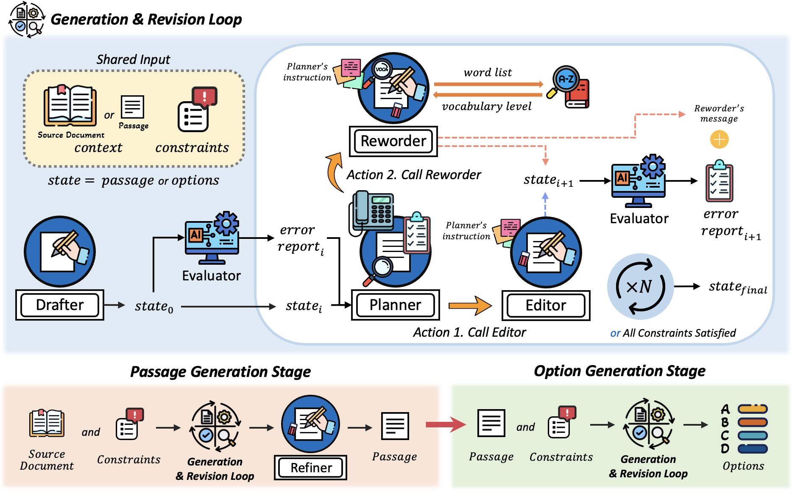
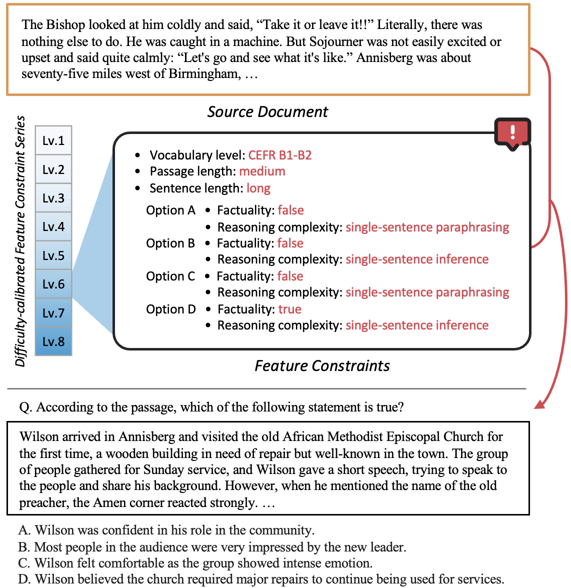

# A Multi-Agent Framework for Feature-Constrained Difficulty Control in Reading Comprehension Item Generation (MAFIG)

**MAFIG** is an LLM-based multi-agent framework designed to generate reading comprehension (RC) items while explicitly controlling item difficulty through feature constraints.

<p align="center">
  
</p>

The framework enables users to pre-specify pedagogically motivated item features—such as linguistic complexity and reasoning demands—and automatically generates RC items that satisfy these constraints through iterative generation and revision.

In the current implementation, MAFIG supports **Multiple-Choice Factual Information (MCFI)** reading comprehension items.

<p align="center">
  
</p>

---

## Repository Structure

```
data/
 ├── Brown.test.json                 # Source documents for RC item generation
 ├── difficulty_series.verified.json # Difficulty-calibrated feature constraint series
 └── exemplars/
     └── exemplar_thoughts.json      # Chain-of-Thought exemplars used in agent prompts

llm_evaluation/
 ├── prompts/                        # Prompt templates for LLM-based evaluation
 ├── utils/generator.py              # OpenAI API wrapper
 ├── eval.py                         # Evaluation pipeline (Validity & Difficulty Alignment)
 └── eval.sh                         # Shell script for evaluation

utils/
 ├── agents.py                       # LLM agent implementations used in MAFIG
 └── evaluators.py                   # Feature-specific evaluators

passage_generation.py                # Passage generation for MCFI items
option_generation.py                 # Option generation for MCFI items
prompts.json                         # Prompt templates for LLM agents and evaluators
Dictionary_nltk.json                 # Vocabulary level dictionary
```

The `Dictionary_nltk.json` file should include words and their level for each NLTK POS tag:
```
{
   "abolish": {
      "VB": "C1"
   },
   "abortion": {
      "NN": "C1"
   }
}
```

---

### 0. Create the Conda Environment

```bash
conda env create -f environment.yml
conda activate mafig
```

### 1. Passage Generation & Option Generation

```bash
bash run.sh
```

This script runs the full MAFIG pipeline, including passage generation, option generation, and iterative revision to satisfy feature constraints.

---

### 2. Evaluation (LLM Judge)

```bash
cd llm_evaluation
bash eval.sh
```

Before running, set your API key inside `eval.sh`:

```bash
export OPENAI_API_KEY=your_api_key_here
```

You can control the evaluation criterion by setting the `CRITERIA` variable to either:

- `validity` — evaluates logical and linguistic validity  
- `pairwise_difficulty` — evaluates relative difficulty alignment between item pairs
